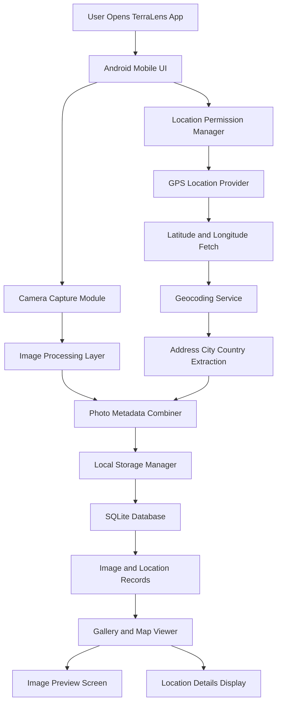

<h1 align="center">TerraLens - SIH 2025</h1>
<div align="center">


**AI-Driven Life Cycle Assessment (LCA) Tool for Advancing Circularity and Sustainability in Metallurgy and Mining**

*Developed for Smart India Hackathon 2025*

</div>

---

## 🏆 Smart India Hackathon Details

- **Problem Statement ID:** SIH25069  
- **Problem Statement Title:** AI-Driven Life Cycle Assessment (LCA) Tool for Advancing Circularity and Sustainability in Metallurgy and Mining  
- **Theme:** Miscellaneous  
- **PS Category:** Software  

---

## 🌍 About the Project

TerraLens LCA is an AI-powered sustainability intelligence platform that helps metallurgy and mining industries measure, analyze, and reduce environmental impact using automated Life Cycle Assessment techniques.

---

## 🎯 Problem Statement

Industries in metallurgy and mining face challenges such as high emissions, heavy energy usage, water consumption, and waste generation. Traditional LCA methods are complex, slow, and difficult for industries to use in real-time decision-making.

---

## 💡 Proposed Solution

TerraLens provides an AI-driven LCA system that:

- Automates environmental impact assessment  
- Uses AI to predict sustainability outcomes  
- Suggests circular economy improvements  
- Generates visual sustainability reports  

---

## ✨ Key Features

- AI-based Life Cycle Assessment  
- Carbon, Energy, Water, and Waste Impact Analysis  
- Circularity Optimization Recommendations  
- Predictive Sustainability Modeling  
- Interactive Web Dashboard  
- Automated Sustainability Reports  

---

## 🛠 Technology Stack

**Backend:** Python, FastAPI/Django, ML Libraries  
**Frontend:** React.js, Chart.js/D3.js  
**Database:** PostgreSQL / MongoDB  
**DevOps:** Docker, GitHub Actions  

---

## 🏗 Project Folder Structure

```
TerraLens-SIH2025/
│
├── backend/
│   ├── app/
│   │   ├── main.py
│   │   ├── routes/
│   │   │   └── lca_routes.py
│   │   ├── services/
│   │   │   ├── lca_engine.py
│   │   │   └── ai_model.py
│   │   └── models/
│   │       └── database.py
│   └── requirements.txt
│
├── frontend/
│   ├── src/
│   │   ├── App.js
│   │   ├── components/
│   │   │   ├── Dashboard.js
│   │   │   └── ReportView.js
│   │   └── api.js
│   └── package.json
│
├── docker-compose.yml
└── README.md
```

---

## 💻 Important Backend Source Code

### 🔹 FastAPI Entry Point (main.py)

```python
from fastapi import FastAPI
from app.routes.lca_routes import router as lca_router

app = FastAPI(title="TerraLens LCA API")

app.include_router(lca_router, prefix="/lca", tags=["LCA"])

@app.get("/")
def read_root():
    return {"message": "TerraLens LCA API Running"}
```

### 🔹 LCA Processing Engine (lca_engine.py)

```python
def calculate_lca(data):
    emissions = data["energy"] * 0.5
    water_impact = data["water"] * 0.3
    waste_impact = data["waste"] * 0.2

    total_score = emissions + water_impact + waste_impact

    return {
        "emissions": emissions,
        "water_impact": water_impact,
        "waste_impact": waste_impact,
        "total_score": total_score
    }
```

### 🔹 AI Prediction Model (ai_model.py)

```python
import numpy as np

def predict_sustainability(score):
    if score < 50:
        return "Sustainable"
    elif score < 100:
        return "Moderate Impact"
    else:
        return "High Environmental Impact"
```

---

## 🌐 Important Frontend Source Code

### 🔹 API Connection (api.js)

```javascript
import axios from "axios";

export const runLCA = async (data) => {
  const response = await axios.post("http://localhost:8000/lca/run", data);
  return response.data;
};
```

### 🔹 Dashboard Component (Dashboard.js)

```javascript
import React, { useState } from "react";
import { runLCA } from "../api";

function Dashboard() {
  const [result, setResult] = useState(null);

  const handleRun = async () => {
    const data = { energy: 100, water: 50, waste: 30 };
    const res = await runLCA(data);
    setResult(res);
  };

  return (
    <div>
      <h2>LCA Dashboard</h2>
      <button onClick={handleRun}>Run Assessment</button>
      {result && <pre>{JSON.stringify(result, null, 2)}</pre>}
    </div>
  );
}

export default Dashboard;
```

---

## 🏗 System Architecture



---


## 🚀 Installation

### Docker Setup

```bash
git clone https://github.com/LoganthP/TerraLens-SIH2025.git
cd TerraLens-SIH2025
docker-compose up -d
```

### Manual Setup

Backend:
```bash
cd backend
python -m venv venv
source venv/bin/activate
pip install -r requirements.txt
python manage.py runserver
```

Frontend:
```bash
cd frontend
npm install
npm start
```

---

## 📖 Usage

1. Open web dashboard  
2. Enter industrial process data  
3. Run AI-powered LCA analysis  
4. View environmental impact metrics  
5. Download sustainability reports  

---

## 🗺 Roadmap

- Core LCA Engine  
- AI Prediction Models  
- Circularity Recommendation System  
- Industry Data Integration  
